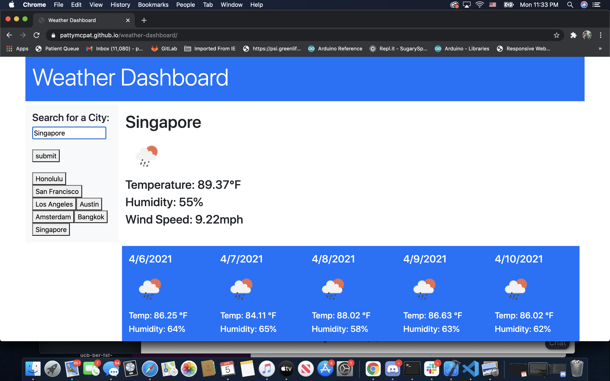

# Weather Dashboard

## User Story
**AS A** traveler 
**I WANT** to see the weather outlook for multiple cities 
**SO THAT**  I can plan a trip accordingly 

## Acceptance Criteria

***GIVEN*** a weather dashboard with form inputs 
**WHEN** I search for a city 
**THEN** I am presented with current and future conditions for that city and that city is added to the search history 
**WHEN** I view current weather conditions for that city 
**THEN** I am presented with the city name, the date, an icon representation of weather conditions, the temperature, the humidity, the wind speed, and the UV index 
**WHEN** I view the UV index 
**THEN** I am presented with a color that indicates whether the conditions are favorable, moderate, or severe 
**WHEN** I view future weather conditions for that city 
**THEN** I am presented with a 5-day forecast that displays the date, an icon representation of weather conditions, the temperature, and the humidity 
**WHEN** I click on a city in the search history 
**THEN** I am again presented with current and future conditions for that city 

## Description
1. first what I did was created an html file with the elements I wanted, search bar, current weather, and 5 day forcast. 
2. in the js file I created a variable with the api key that I got from open weather. 
3. I created a function that would pull the user input field and store that into a variable. Then using the user input plug that into the fetch URL to get back a JSON format of the data
4. I parsed through the data returned and set them to variables I created to individual data points I wanted to highlight: current temp, humidity and windspeed. Once I have these variables set, I used innerHTML to add them to the DOM
5.  I created a function to pull the 5 day forcast to get back a JSON format that I can pull data from. once I had the data stored into variables I used innerHTML to display them on the DOM
6. Created a Function to add a new button element everytime the submit button is pressed with with the value of the input box. 
7. used localstorage.setitem in the get current city function to store the searched cities in an array
8. used localstorage.getitem to pull from the search cities array once the page loads and create buttons for every item in the array. 

## Technology Used
1. HTML
2. CSS
3. Bootstrap framework for CSS
4. Javascript
5. OpenWeather API
6. moment.js

## Screenshot
